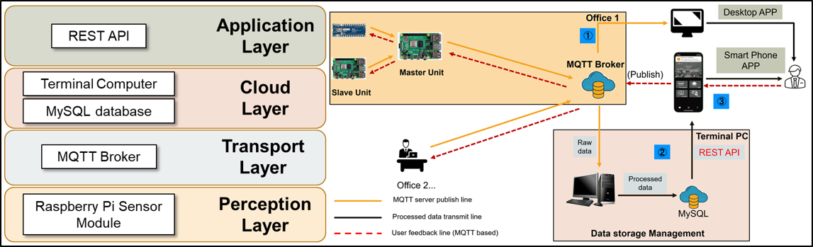
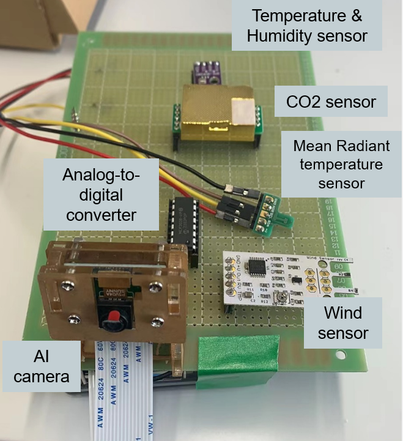
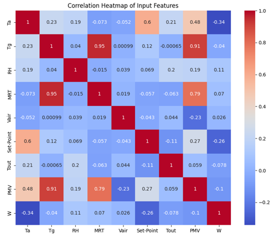

# Set-point-temperature-based-HVAC-energy-consumption-prediction-model

HVAC energy consumption constitutes a significant portion of total building energy usage.  \
In particular, changes in the set-point temperature have a substantial impact on energy consumption.  \
Understanding how energy consumption varies with a 1°C increase or decrease in the set-point temperature is crucial for optimizing energy efficiency.
## Measurement system structure

  

## IoT measurement device 
This device consists of 3 parts, thermal environment measurement module, indoor air quality module(CO2, pm2.5,pm10) and text recognition module.
- For thermal comfort index you can check [**pmv**](https://github.com/Raskiller503/Thermal-comfort-tool-)
- For text recognition you can check [**Set-point control panel**](https://github.com/Raskiller503/ImageRecognition-AC-pannel-_-OpenCV)

  

## Correlation
The dataset was collected in Summer, we could find that set-point temperature has the most negative influence to HVAC energy consumption.

  

# Machine Learning model algorithm

